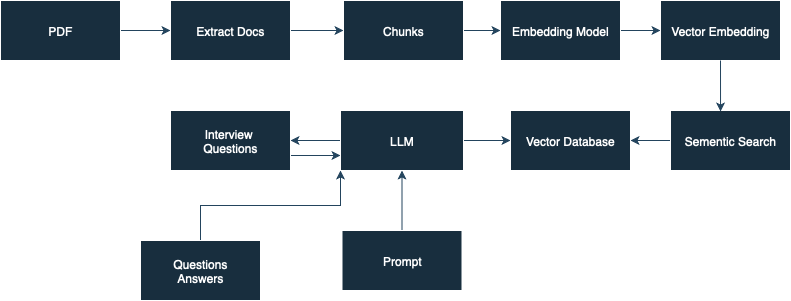
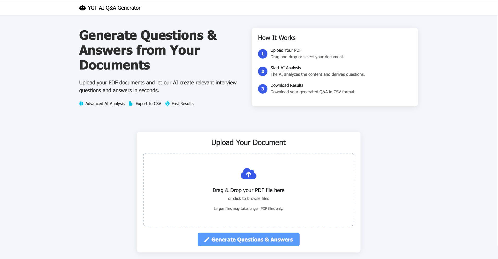
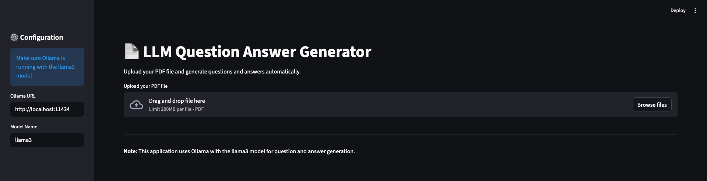

# 📄 LLM Question & Answer Generator

[](https://python.org)
[](https://fastapi.tiangolo.com)
[](https://streamlit.io)
[](https://www.langchain.com/)
[](https://ollama.com/)
[](LICENSE)

A powerful **AI-powered application** that generates structured interview questions and detailed answers directly from PDF documents.  
Built on **Retrieval Augmented Generation (RAG)** architecture with a local **Large Language Model (LLM)** for accurate, context-aware Q&A generation.

This project focuses on **automatic question generation using Large Language Models (LLMs)**. The notebook demonstrates how to extract information from text passages and generate meaningful, context-aware questions automatically — a process useful for building intelligent tutoring systems, interview preparation tools, and data-driven content curation systems.

## 📘 Project Overview

The notebook (`experiment.ipynb`) contains a workflow for:

- Loading and preprocessing text data  
- Using **LLM-based pipelines** to generate contextually relevant questions  
- Refining question quality through prompt engineering  
- Automating evaluation of generated questions  
- Experimenting with different **chain-based architectures** (`LLMChain`, `RefineDocumentsChain`, etc.) for document-level understanding

The code demonstrates how to handle **multi-step reasoning** and **text-to-question transformation** efficiently.

---
## ⚙️ How It Works



1. **PDF Extraction** — Extracts and cleans text from the uploaded file.  
2. **Text Chunking** — Splits text into manageable overlapping chunks.  
3. **Embedding & Retrieval** — Creates vector embeddings and stores them in **FAISS**.  
4. **Question Generation** — Uses Llama3 (via Ollama) to produce meaningful questions.  
5. **Answer Generation** — Retrieves context and generates grounded answers.  
6. **Export** — Saves all pairs to a downloadable CSV file.  
   
---

## ✨ Key Features

- 🔍 **Intelligent Q&A Generation** — Generates relevant questions and well-structured answers using **Ollama (Llama3)**.  
- 🧠 **RAG Architecture** — Uses **FAISS** for efficient document retrieval and grounding.  
- ⚡ **Dual Interfaces** — Access via both **FastAPI** (web app) and **Streamlit** (interactive dashboard).  
- 🧩 **Flexible Embeddings** — Powered by **HuggingFace Sentence Transformers** for semantic search.  
- 📤 **Export Results** — Download generated Q&A pairs as a clean **CSV file**.  

---


## 🖥️ Interfaces

<div align="center">

### FastAPI Web Application  


### Streamlit Dashboard  


</div>

---

## ⚙️ Setup and Usage

### Prerequisites

- Python **3.8+**
- [Ollama](https://ollama.ai/) installed and running locally  

### Ollama Setup

```bash
# Install and run Ollama
ollama serve

# Pull the required model
ollama pull llama3
```

### Install Dependencies

```bash
pip install -r requirements.txt
```

---

## 🚀 Running the Applications

### 1️⃣ FastAPI Web Application

```bash
python app.py
```

Then open: [http://localhost:8080](http://localhost:8080)

### 2️⃣ Streamlit Application

```bash
streamlit run streamlit_app.py
```

Then open: [http://localhost:8501](http://localhost:8501)

---

## 🧩 Project Structure

```
interview-questions-project/
├── src/
│   ├── helper.py           # Core pipeline functions
│   ├── prompt.py           # LLM prompt templates
│   └── config.py           # Configuration settings
├── templates/
│   └── index.html          # FastAPI web template
├── static/
│   ├── docs/               # Uploaded PDF files
│   └── output/             # Generated CSV results
├── app.py                  # FastAPI app entry point
├── streamlit_app.py        # Streamlit dashboard
├── requirements.txt        # Dependencies
├── install_dependencies.sh # Setup script
├── start_web_app.sh        # Start FastAPI app
├── start_streamlit.sh      # Start Streamlit app
└── README.md               # Documentation
```


---

## 🛠️ Tech Stack

| Component | Technology |
|------------|-------------|
| **LLM** | Ollama (Llama3) |
| **Frameworks** | FastAPI, Streamlit |
| **RAG Engine** | LangChain + FAISS |
| **Embeddings** | Sentence Transformers (`all-MiniLM-L6-v2`) |
| **PDF Processing** | PyPDF / pdfplumber |
| **Storage** | Local file system (CSV export) |

---

## 🚀 Future Improvements

- Integration with **evaluation metrics** for automatic scoring  
- Adding support for **multi-lingual question generation**  
- Building a **Streamlit UI** for interactive question generation  
- Incorporating **context memory** to improve continuity between questions  

## 🤝 Contributing

Contributions are welcome!  
To contribute:
1. Fork the repo  
2. Create a feature branch  
3. Make your changes  
4. Test thoroughly  
5. Open a pull request  

---

## 📜 License

This project is released under the **MIT License** — see the [LICENSE](LICENSE) file for details.

---
